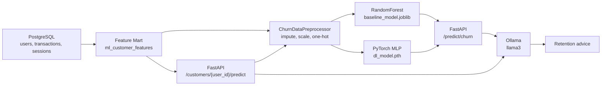

# RetainAI: Churn & LTV Intelligence with LLM Recommendations

RetainAI is a portfolio-grade AI Engineering and Data Science project for customer churn prediction and retention advice generation.

The system combines:

- PostgreSQL feature mart built with SQL, joins and window functions.
- pandas/scikit-learn preprocessing pipeline.
- RandomForest churn baseline with feature importances.
- PyTorch MLP model for tabular churn prediction.
- FastAPI inference service.
- Local LLM recommendations through Ollama.
- Streamlit demo UI.
- Docker Compose infrastructure.

## Architecture



Short version:

```text
PostgreSQL -> Feature Mart -> Preprocessor -> ML/DL Models -> FastAPI -> Ollama
```

## Project Structure

```text
RetainAI/
  sql/
    init.sql              # DB schema and synthetic data generation
    extract.sql           # ML feature mart with window functions
  src/
    preprocessing.py      # sklearn preprocessing pipeline
    baseline.py           # RandomForest baseline
    dl_model.py           # PyTorch MLP model
    api.py                # FastAPI inference service
    ui.py                 # Streamlit demo UI
  artifacts/
    preprocessor.joblib
    baseline_model.joblib
    dl_model.pth
    metrics.json
  requirements.txt
  Dockerfile
  docker-compose.yml
  .env.example
  README.md
```

## Environment Variables

Use `.env.example` as a template.

```bash
cp .env.example .env
```

Where the values come from:

| Variable | Where to get it | Local value | Docker Compose value |
|---|---|---:|---:|
| `OLLAMA_URL` | Ollama local API endpoint | `http://localhost:11434/api/generate` | `http://host.docker.internal:11434/api/generate` |
| `OLLAMA_MODEL` | Model name installed in Ollama | `llama3` | `llama3` |
| `RETAINAI_ARTIFACT_DIR` | Folder with trained model files | `artifacts` | `/app/artifacts` |
| `POSTGRES_HOST` | DB hostname | `localhost` | `db` |
| `POSTGRES_PORT` | DB port | `5432` | `5432` |
| `POSTGRES_DB` | Database name from compose | `retainai` | `retainai` |
| `POSTGRES_USER` | User from compose | `retainai` | `retainai` |
| `POSTGRES_PASSWORD` | Password from compose | `retainai_password` | `retainai_password` |
| `RETAINAI_API_URL` | FastAPI URL for Streamlit | `http://localhost:8000` | `http://localhost:8000` |

Ollama setup:

```powershell
ollama pull llama3
```

If Ollama is not running, the API still works and returns a deterministic fallback recommendation.

## Local Setup

```powershell
python -m venv .venv
.\.venv\Scripts\Activate.ps1
python -m pip install --upgrade pip
pip install -r requirements.txt
```

Train and save artifacts:

```powershell
python src\preprocessing.py
python src\baseline.py
python src\dl_model.py
```

Expected artifacts:

```text
artifacts/preprocessor.joblib
artifacts/baseline_model.joblib
artifacts/dl_model.pth
artifacts/metrics.json
```

## Docker Run

Start Docker Desktop first, then run:

```powershell
docker compose up --build
```

If you need to recreate PostgreSQL from scratch:

```powershell
docker compose down -v
docker compose up --build
```

Services:

- FastAPI: `http://localhost:8000`
- Swagger UI: `http://localhost:8000/docs`
- PostgreSQL: `localhost:5432`

Health check:

```powershell
Invoke-RestMethod http://localhost:8000/health
```

## API Endpoints

### `GET /health`

Checks model artifact loading and database connection.

### `POST /predict/churn`

Accepts a full feature payload and returns churn probabilities from both models plus LLM advice.

### `GET /customers/{user_id}/predict`

Fetches customer features from PostgreSQL materialized view `retainai.ml_customer_features`, runs both models and returns retention advice.

Example:

```powershell
Invoke-RestMethod http://localhost:8000/customers/101/predict
```

Example response:

```json
{
  "user_id": 101,
  "baseline_churn_probability": 0.38945,
  "dl_churn_probability": 0.388563,
  "ensemble_churn_probability": 0.389007,
  "risk_segment": "low",
  "retention_advice": "Generated retention recommendation...",
  "llm_model": "llama3",
  "llm_available": true
}
```

## Metrics

Training scripts save metrics to:

```text
artifacts/metrics.json
```

The file contains:

- RandomForest ROC-AUC, F1, Precision, Recall.
- RandomForest top feature importances.
- PyTorch MLP ROC-AUC and F1.
- PyTorch training summary.

Regenerate:

```powershell
python src\baseline.py
python src\dl_model.py
```

## Streamlit UI Demo

Start the backend first:

```powershell
docker compose up --build
```

Then in another terminal:

```powershell
.\.venv\Scripts\Activate.ps1
streamlit run src\ui.py
```

The UI lets you:

- choose a customer ID;
- call `GET /customers/{user_id}/predict`;
- see baseline, deep learning and ensemble churn probabilities;
- see the risk segment;
- read the LLM retention recommendation.

## Skills Demonstrated

- SQL schema design, joins, materialized views and window functions.
- Feature engineering for churn and LTV.
- sklearn pipelines with custom transformers.
- Imbalanced classification with RandomForest.
- PyTorch Dataset, DataLoader, MLP, BatchNorm, Dropout, AdamW and early stopping.
- FastAPI model serving and lifecycle management.
- Local LLM integration with Ollama.
- Dockerized API and PostgreSQL infrastructure.
